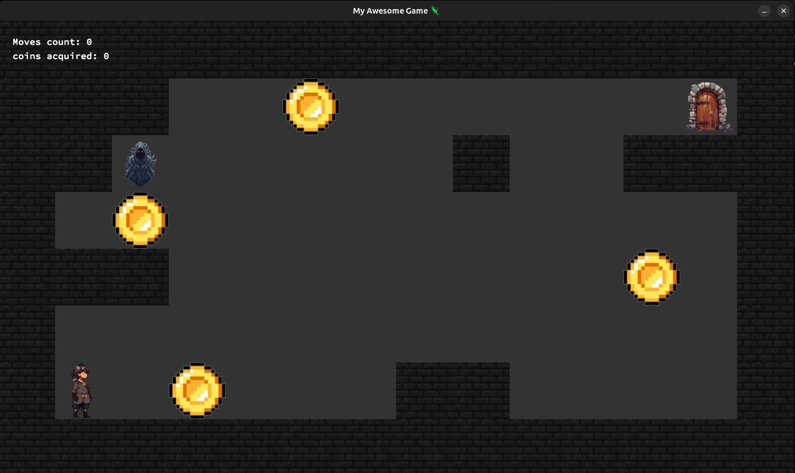
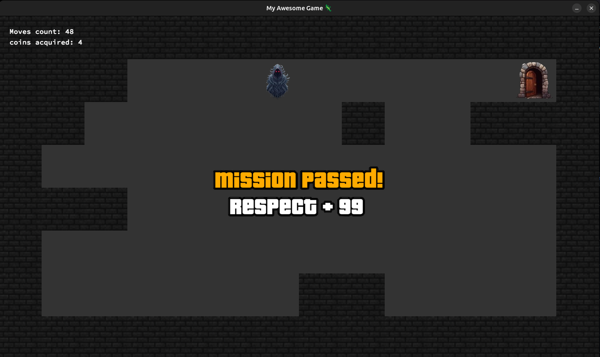
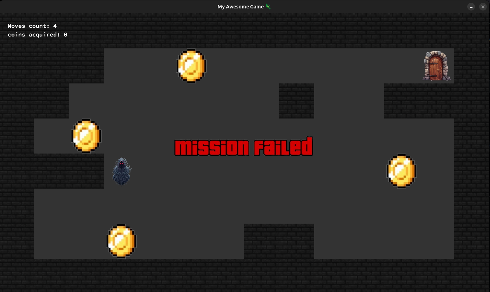

# So_long 🗺️

This project has been created as part of the 42 curriculum.

## 📖 Description

So_long is a 42 School project that serves as an introduction to **graphics programming**, using the MiniLibX library. The goal is to build a small 2D game where a character navigates through a map, collects all the collectibles scattered across it, and reaches the exit — all while keeping the number of moves as low as possible.

The map is loaded from a `.ber` file and must respect strict rules:
- Surrounded entirely by walls (no gaps that would let the player walk off-map)
- Exactly one player spawn point
- Exactly one exit
- At least one collectible
- A path must exist between the player, every collectible, and the exit

If any of these conditions aren't met, the program exits cleanly with an appropriate error message.

## ✨ Extra Mile

Instead of sticking to static sprites, I went a step further and added:

- **Animated player** — walking animations instead of a single static texture, so movement actually feels alive.
- **Animated collectibles** — the coins have their own idle animation, making the map feel more dynamic instead of flat.
- **Enemy AI** — an enemy that tracks and follows the player's exact position across the map, adding an actual threat instead of a purely peaceful stroll to the exit.
- **Death screen** — if the player runs out of moves or fails the level, a dedicated death screen is displayed instead of just closing or freezing the game.
- **Win screen** — collecting everything and reaching the exit triggers a proper victory screen, giving the player clear feedback that they've completed the map.




These additions weren't required by the subject but made the game feel a lot closer to an actual playable experience rather than a technical demo.

## ⚙️ Instructions

### Prerequisites

Make sure you have `make`, a compatible compiler, and the **MiniLibX** library installed on your system.

### Step 1 — Compile

In your terminal, navigate to the project directory and run:

```bash
make
```

This will compile the source files and produce the `so_long` executable.

### Step 2 — Run

Launch the game by passing a valid `.ber` map file as an argument:

```bash
./so_long your_map.ber
```

Replace `your_map.ber` with the path to your actual map file. For example:

```bash
./so_long maps/valid/simple.ber
```

## 🎮 Controls

| Key | Action |
|-----|--------|
| `W` / `↑` | Move up |
| `S` / `↓` | Move down |
| `A` / `←` | Move left |
| `D` / `→` | Move right |
| `Esc` / window close | Quit the game |

## 🧠 What This Project Covers

- Graphics rendering with MiniLibX
- Parsing and validating map files
- Sprite handling and animation logic
- Pathfinding to validate map solvability
- Clean memory management for a long-running graphical loop

## 📚 Resources

- [MiniLibX Documentation](https://harm-smits.github.io/42docs/libs/minilibx)

---
*Part of the 42 School common core curriculum.*
